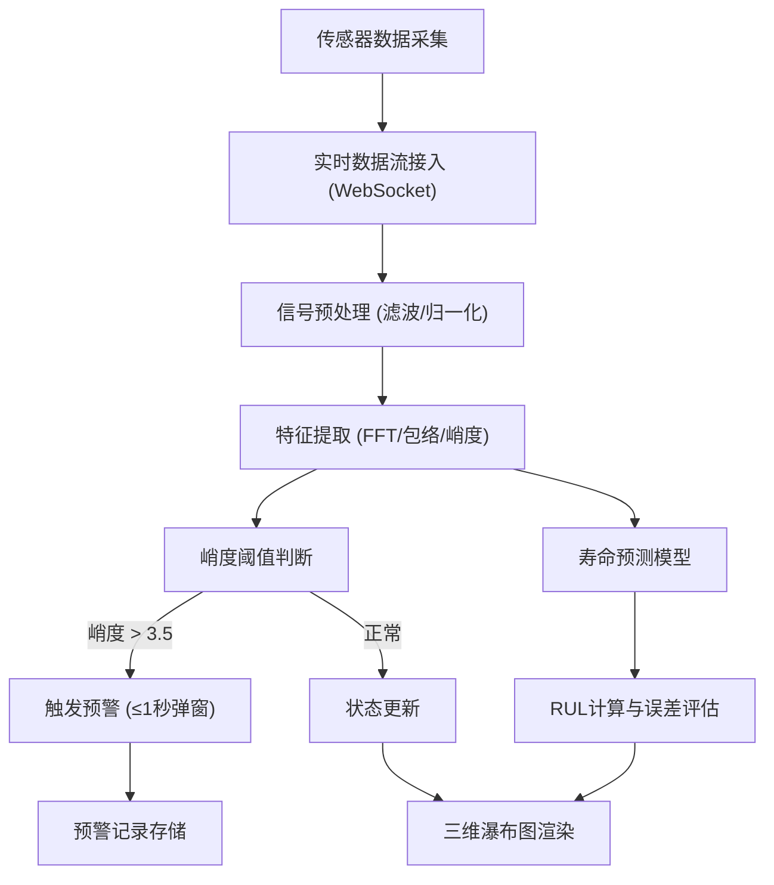

## 1. 产品概述

旋转机械振动预测系统是一套面向工业设备状态监测的实时振动分析与故障预警平台，支持10路以上加速度传感器数据接入，每秒处理5000点振动波形，通过频谱分析、峭度指标提取和剩余寿命预测模型，实现设备故障早期预警和寿命预测。

- **核心价值**：提前发现设备异常，降低非计划停机风险，提升设备运维效率
- **目标用户**：设备运维工程师、工业监测人员、设备管理部门
- **应用场景**：电机、泵、风机、齿轮箱等旋转机械的状态监测与故障诊断

## 2. 核心功能

### 2.1 用户角色

| 角色 | 注册方式 | 核心权限 |
|------|----------|----------|
| 运维工程师 | 账号登录 | 实时监控、查看历史数据、配置预警阈值 |
| 管理员 | 账号登录 | 用户管理、系统配置、模型调参 |

### 2.2 功能模块

1. **实时监控面板**：10路传感器实时波形展示、峭度指标仪表盘、状态指示灯
2. **三维瀑布图**：频谱-时间-幅值三维可视化，支持旋转、缩放、切片查看
3. **故障预警系统**：峭度超阈值实时预警、弹窗告警（≤1秒）、预警历史记录
4. **寿命预测模块**：剩余寿命（RUL）预测、退化趋势曲线、置信区间展示
5. **数据管理**：历史数据查询、波形回放、数据导出

### 2.3 页面详情

| 页面名称 | 模块名称 | 功能描述 |
|-----------|-------------|---------------------|
| 实时监控页 | 传感器波形区 | 10路传感器实时振动波形，可切换单路/多路显示，5000点/秒刷新 |
| 实时监控页 | 指标仪表盘 | 峭度、峰值、有效值等关键指标实时显示，超阈值红色高亮 |
| 实时监控页 | 预警弹窗 | 峭度>3.5时1秒内弹出告警，显示传感器编号、峭度值、故障等级 |
| 瀑布图页 | 三维瀑布图 | 频谱包络随时间变化的三维可视化，支持鼠标交互旋转缩放 |
| 寿命预测页 | RUL趋势图 | 剩余寿命预测曲线、70%退化点标记、误差带显示 |
| 系统设置页 | 阈值配置 | 峭度预警阈值、传感器参数、采样率配置 |

## 3. 核心流程

## 4. 用户界面设计

### 4.1 设计风格

- **主色调**：深空蓝 (#0a1628) 作为背景主色，科技青 (#00d4ff) 作为主强调色
- **辅助色**：预警红 (#ff4757)、正常绿 (#2ed573)、警告黄 (#ffa502)
- **字体**：标题使用 Orbitron 科技感字体，正文使用 JetBrains Mono 等宽字体
- **布局**：深色工业仪表盘风格，网格化布局，数据卡片带微光边框
- **动效**：数据刷新微动画、预警脉冲闪烁、瀑布图渐变过渡
- **图标风格**：线性科技图标，发光效果

### 4.2 页面设计概览

| 页面名称 | 模块名称 | UI元素 |
|-----------|-------------|-------------|
| 实时监控页 | 顶部导航栏 | Logo、系统名称、时间、预警数量徽标 |
| 实时监控页 | 传感器卡片区 | 10个传感器卡片，波形缩略图、峭度值、状态指示灯 |
| 实时监控页 | 主波形区 | 大幅实时波形，可切换通道，X轴时间/Y轴幅值 |
| 瀑布图页 | 三维画布 | 全屏WebGL渲染，光谱色阶，鼠标拖拽旋转 |
| 瀑布图页 | 控制面板 | 视角重置、色阶调整、时间范围选择 |
| 寿命预测页 | 趋势图区 | 退化曲线、RUL预测、70%退化基准线 |
| 寿命预测页 | 指标卡 | 当前健康度、预测寿命、误差范围 |

### 4.3 响应式

- 桌面端优先设计，适配 1920×1080 及以上分辨率
- 支持多屏监控布局，关键指标卡片可独立拖拽
- 触控设备支持手势缩放瀑布图

### 4.4 三维场景设计

- **环境**：深色科技感背景，微弱网格地板，空间感强
- **光照**：环境光 + 边缘光，突出瀑布图的立体感
- **相机**：初始45°俯视角，支持轨道控制器环绕查看
- **交互**：鼠标左键旋转、滚轮缩放、右键平移
- **后处理**：轻微辉光效果，增强科技感
- **性能**：使用 BufferGeometry 优化大数据量渲染，保持60fps
