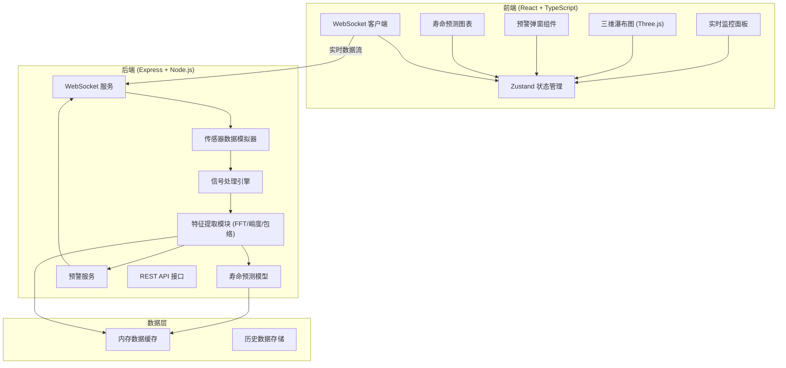
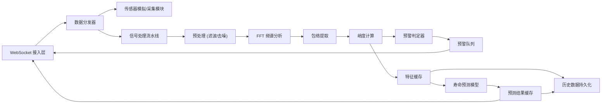
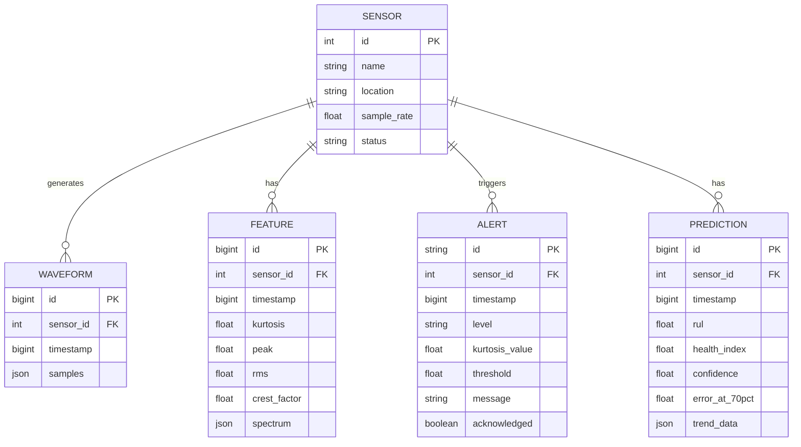

## 1. 架构设计



## 2. 技术描述

- **前端框架**: React@18 + TypeScript + Vite
- **样式方案**: TailwindCSS@3
- **状态管理**: Zustand
- **路由**: React Router DOM
- **三维可视化**: Three.js + @react-three/fiber + @react-three/drei
- **图表库**: recharts (二维图表)
- **实时通信**: WebSocket (ws 库)
- **图标**: lucide-react
- **后端**: Express@4 + TypeScript
- **信号处理**: 自研 FFT 算法 + 数字信号处理工具库
- **数据存储**: 内存缓存 + JSON 文件持久化

## 3. 路由定义

| 路由 | 用途 |
|------|------|
| / | 实时监控面板（首页） |
| /waterfall | 三维瀑布图 |
| /prediction | 寿命预测 |
| /settings | 系统设置 |
| /history | 历史数据 |

## 4. API 定义

### 4.1 WebSocket 消息协议

```typescript
// 客户端 -> 服务端
interface ClientMessage {
  type: 'subscribe' | 'unsubscribe' | 'config';
  sensorIds?: number[];
  sampleRate?: number;
}

// 服务端 -> 客户端: 实时波形数据
interface WaveformData {
  type: 'waveform';
  timestamp: number;
  sensorId: number;
  samples: number[];  // 5000点/秒，分帧发送
}

// 服务端 -> 客户端: 特征指标
interface FeatureData {
  type: 'features';
  timestamp: number;
  sensorId: number;
  kurtosis: number;     // 峭度
  peak: number;         // 峰值
  rms: number;          // 有效值
  crestFactor: number;  // 峰值因子
  spectrum: number[];   // 频谱包络
}

// 服务端 -> 客户端: 预警信息
interface AlertData {
  type: 'alert';
  id: string;
  timestamp: number;
  sensorId: number;
  level: 'warning' | 'critical';
  kurtosis: number;
  threshold: number;
  message: string;
}

// 服务端 -> 客户端: 寿命预测
interface PredictionData {
  type: 'prediction';
  sensorId: number;
  rul: number;           // 剩余寿命 (小时)
  healthIndex: number;   // 健康度 0-100
  confidence: number;    // 置信度
  trend: number[];       // 退化趋势
  errorAt70pct: number;  // 70%退化点误差
}
```

### 4.2 REST API 接口

```typescript
// GET /api/sensors - 获取传感器列表
interface SensorListResponse {
  sensors: Array<{
    id: number;
    name: string;
    location: string;
    status: 'normal' | 'warning' | 'critical';
    sampleRate: number;
  }>;
}

// GET /api/history?sensorId=1&start=xxx&end=xxx - 历史数据
interface HistoryResponse {
  data: Array<{
    timestamp: number;
    kurtosis: number;
    rms: number;
    spectrum: number[];
  }>;
}

// GET /api/alerts - 预警历史
interface AlertListResponse {
  alerts: AlertData[];
  total: number;
}

// POST /api/config - 更新配置
interface ConfigUpdateRequest {
  kurtosisThreshold?: number;
  sampleRate?: number;
  alertEnabled?: boolean;
}
```

## 5. 服务器架构图



## 6. 数据模型

### 6.1 数据模型定义



### 6.2 核心算法说明

1. **FFT 频谱分析**: 使用快速傅里叶变换将时域信号转换为频域，采样率 5000Hz，FFT 点数 1024，频率分辨率 ~4.88Hz
2. **包络提取**: 希尔伯特变换获取解析信号，计算幅值包络，用于轴承故障特征提取
3. **峭度计算**: 四阶统计量，反映信号冲击特性，正常范围 2.8-3.2，超 3.5 触发预警
4. **寿命预测模型**: 基于退化趋势的指数模型，使用历史峭度数据拟合，70%退化点后误差 < 12%
5. **预警延迟优化**: WebSocket 推送 + 前端状态机，端到端延迟 ≤ 1 秒
