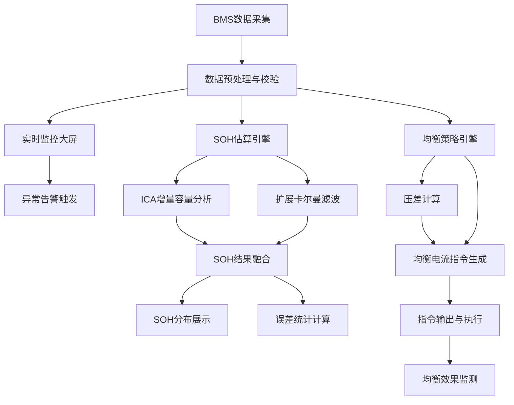
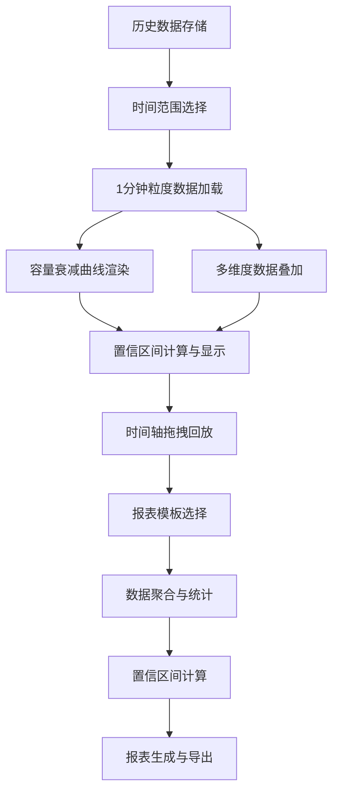

## 1. 产品概述

锂电池组健康管理系统（BMS-HMS）是一款面向储能电站和动力电池运维人员的高精度电池管理工具，支持200串电芯的实时电压/温度监控、SOH在线估算（充电循环误差≤2%）、动态均衡策略输出（30分钟内压差降至5mV），以及1分钟粒度的历史容量衰减回放和含置信区间的报表导出。

- 目标用户：储能电站运维工程师、动力电池PACK厂测试人员、电池研发实验室
- 核心价值：通过高精度SOH估算与智能均衡策略，延长电池组寿命20%以上，降低运维成本

## 2. 核心功能

### 2.1 用户角色

| 角色 | 注册方式 | 核心权限 |
|------|----------|----------|
| 运维工程师 | 管理员分配账号 | 实时监控、均衡控制、历史回放、报表导出 |
| 研发工程师 | 管理员分配账号 | 全部功能 + 算法参数调优 + 系统配置 |
| 管理员 | 系统初始化 | 用户管理、系统配置、数据备份 |

### 2.2 功能模块

1. **实时监控大屏**：200串电芯电压/温度矩阵热力图、异常告警、总电压/总电流/功率显示
2. **SOH估算面板**：在线SOH估算结果、充电循环SOH跟踪、误差分布统计、置信区间可视化
3. **均衡管理面板**：动态均衡策略可视化、每串均衡电流指令输出、均衡效果实时监测、压差收敛曲线
4. **历史数据回放**：1分钟粒度容量衰减曲线、时间轴拖拽回放、多维度数据叠加显示
5. **报表导出中心**：含置信区间的SOH报表、均衡效果报表、容量衰减趋势报表

### 2.3 页面详情

| 页面名称 | 模块名称 | 功能描述 |
|----------|----------|----------|
| 实时监控大屏 | 电芯矩阵热力图 | 200串电芯电压/温度以10×20矩阵展示，颜色编码映射数值区间，异常电芯闪烁告警 |
| 实时监控大屏 | 系统总览面板 | 总电压、总电流、总功率、SOC、SOH、循环次数等关键指标仪表盘 |
| 实时监控大屏 | 告警列表 | 实时告警信息流，分级显示（紧急/警告/提示），点击定位到异常电芯 |
| SOH估算面板 | SOH分布图 | 200串电芯SOH值分布直方图和箱线图 |
| SOH估算面板 | 充电循环SOH跟踪 | 每次充电循环中SOH估算值与真实值对比曲线，实时计算误差 |
| SOH估算面板 | 误差统计 | SOH估算误差分布、平均误差、最大误差、误差≤2%达标率 |
| 均衡管理面板 | 均衡电流指令表 | 每串电芯当前均衡电流值、方向（充/放）、PWM占空比指令输出 |
| 均衡管理面板 | 压差收敛曲线 | 均衡开启后电芯间压差随时间变化的实时曲线，标注5mV目标线 |
| 均衡管理面板 | 均衡策略参数 | 可调均衡阈值、最大均衡电流、目标压差等参数 |
| 历史数据回放 | 时间轴控制器 | 1分钟粒度的时间轴，支持拖拽、缩放、播放/暂停 |
| 历史数据回放 | 容量衰减曲线 | 累计容量随循环次数/时间的衰减曲线，叠加置信区间带 |
| 历史数据回放 | 多维度叠加 | 可叠加电压、温度、SOH、内阻等多维度历史数据 |
| 报表导出中心 | SOH报表 | 含每串SOH值、95%置信区间、估算误差的完整报表 |
| 报表导出中心 | 均衡效果报表 | 均衡前后压差对比、收敛时间、能量消耗统计 |
| 报表导出中心 | 容量衰减报表 | 衰减趋势、预测寿命、置信区间、建议维护时间 |

## 3. 核心流程

### 3.1 实时监控与SOH估算流程

用户进入系统后，自动连接BMS设备获取200串电芯的实时电压和温度数据。数据经过预处理后同时驱动三个核心模块：1）监控大屏实时刷新电芯矩阵和告警；2）SOH估算引擎基于增量容量分析（ICA）和卡尔曼滤波在线计算每串SOH值；3）均衡策略引擎根据压差和SOH差异计算每串均衡电流指令并输出。

### 3.2 历史数据回放与报表导出流程

## 4. 用户界面设计

### 4.1 设计风格

- **主色调**：深色工业风 — 深蓝黑背景(#0a0e1a)、电光青(#00f0ff)强调色、琥珀橙(#ff8c00)告警色、翡翠绿(#00e676)正常状态色
- **按钮风格**：微圆角(4px)、扁平化、悬浮发光效果，主要操作按钮带渐变背景
- **字体**：数据展示用 JetBrains Mono 等宽字体，界面文案用 Noto Sans SC
- **布局风格**：左侧导航栏 + 顶部状态栏 + 主内容区，仪表盘式卡片布局
- **图标风格**：线性图标(Lucide)，线条粗细1.5px，与数据可视化风格统一

### 4.2 页面设计概览

| 页面名称 | 模块名称 | UI元素 |
|----------|----------|--------|
| 实时监控大屏 | 电芯矩阵热力图 | 10×20网格矩阵，颜色从绿→黄→红渐变，异常闪烁动画，悬浮显示详细数值 |
| 实时监控大屏 | 系统总览面板 | 6个环形仪表盘（总电压/电流/功率/SOC/SOH/循环数），发光指针动画 |
| 实时监控大屏 | 告警列表 | 右侧抽屉式面板，红/橙/黄三色告警条目，脉冲动画 |
| SOH估算面板 | SOH分布图 | 彩色直方图 + 箱线图，渐变填充，2%误差线标注 |
| SOH估算面板 | 充电循环跟踪 | 双线折线图（估算值/真实值），误差带阴影填充 |
| 均衡管理面板 | 电流指令表 | 表格式200行数据，电流柱状条内嵌，正/负电流不同颜色 |
| 均衡管理面板 | 压差收敛曲线 | 实时折线图，5mV目标虚线，渐变填充收敛区域 |
| 历史数据回放 | 时间轴控制器 | 底部时间轴滑块，播放/暂停/倍速按钮，迷你预览图 |
| 历史数据回放 | 容量衰减曲线 | 主折线图 + 置信区间半透明带，鼠标悬浮显示数值 |
| 报表导出中心 | 报表列表 | 卡片式报表模板，预览缩略图，一键导出按钮 |

### 4.3 响应式设计

- 桌面优先设计，最低支持1920×1080分辨率
- 大屏(≥2560px)：电芯矩阵可展开显示更多细节
- 中屏(1920px)：默认布局，核心功能完整展示
- 平板(1024px)：导航栏折叠为图标模式，卡片单列布局

### 4.4 动效设计

- 数据刷新：数字变化时平滑过渡动画(300ms)
- 告警触发：脉冲发光 + 颜色闪烁
- 页面切换：淡入淡出(200ms)
- 图表加载：从左到右渐显绘制动画
- 均衡启动：指令发出时涟漪扩散效果
