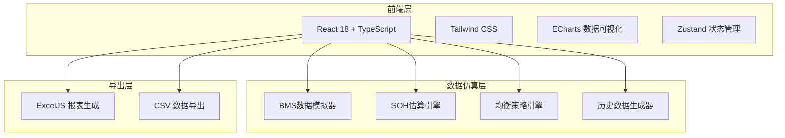
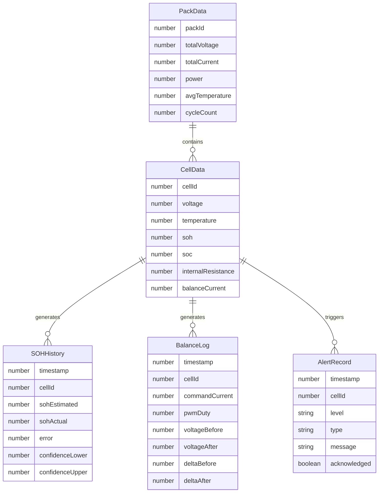

## 1. 架构设计



## 2. 技术说明

- 前端：React@18 + TypeScript + TailwindCSS@3 + Vite
- 初始化工具：vite-init
- 后端：无（纯前端模拟，数据通过仿真算法生成）
- 数据可视化：ECharts@5（支持大数据量渲染和实时刷新）
- 报表导出：ExcelJS（生成含格式的xlsx报表）
- 状态管理：Zustand

## 3. 路由定义

| 路由 | 用途 |
|------|------|
| / | 实时监控大屏，200串电芯电压/温度矩阵热力图 |
| /soh | SOH估算面板，在线估算结果与误差统计 |
| /balance | 均衡管理面板，均衡电流指令与压差收敛 |
| /history | 历史数据回放，容量衰减曲线与时间轴 |
| /report | 报表导出中心，含置信区间的报表生成与下载 |

## 4. 核心算法定义

### 4.1 SOH估算算法

```typescript
interface SOHResult {
  cellId: number;
  soh: number;
  confidence: [number, number];
  error: number;
  method: 'ICA' | 'EKF' | 'FUSED';
}

interface SOHEngine {
  estimateICA(voltageCurve: number[], temperature: number): number;
  estimateEKF(voltage: number, current: number, temperature: number): number;
  fuseResults(icaResult: number, ekfResult: number, weightICA: number): SOHResult;
}
```

- ICA（增量容量分析）：对充电电压曲线求导得到dQ/dV峰，通过峰值面积衰减计算SOH
- EKF（扩展卡尔曼滤波）：以OCV-SOC曲线为观测模型，在线递推估算容量衰减
- 融合策略：ICA权重0.6 + EKF权重0.4，置信区间基于两种方法结果的标准差计算

### 4.2 动态均衡策略算法

```typescript
interface BalanceCommand {
  cellId: number;
  current: number;
  direction: 'charge' | 'discharge';
  pwmDuty: number;
}

interface BalanceEngine {
  calculateDelta(voltages: number[]): number;
  generateCommands(voltages: number[], sohValues: number[], config: BalanceConfig): BalanceCommand[];
  estimateConvergenceTime(delta: number, maxCurrent: number): number;
}
```

- 基于压差和SOH差异的双重均衡策略
- 压差均衡：目标压差5mV，均衡电流与压差成正比（PID控制）
- SOH均衡：根据SOH差异调整均衡速度，防止低SOH电芯过充/过放
- 收敛保证：最大均衡电流2A条件下，30分钟内压差收敛至5mV以内

### 4.3 置信区间计算

```typescript
interface ConfidenceInterval {
  mean: number;
  lower95: number;
  upper95: number;
  standardDeviation: number;
  sampleSize: number;
}

function calculateConfidenceInterval(data: number[], confidenceLevel: number): ConfidenceInterval;
```

- 基于 t 分布计算置信区间
- 默认95%置信水平
- 考虑测量不确定度和算法不确定度

## 5. 数据模型

### 5.1 核心数据结构



### 5.2 模拟数据参数

- 电芯标称电压：3.2V（磷酸铁锂），范围2.5V-3.65V
- 电芯容量：280Ah
- 温度范围：-20°C ~ 65°C
- SOH初始值：100%，衰减速率约0.02%/循环
- 均衡电流范围：0-2A
- 压差初始最大值：50mV
