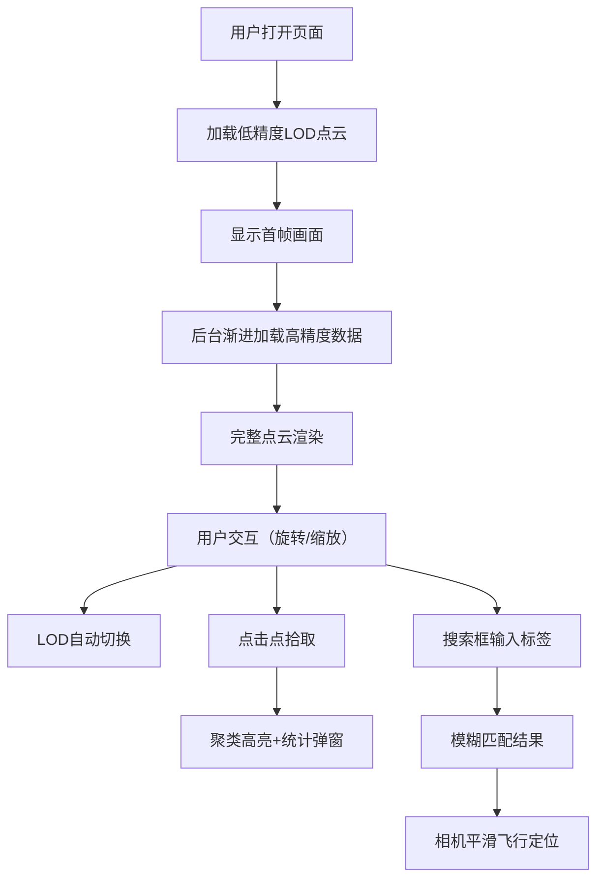

## 1. 产品概述
高性能3D点云聚类可视化平台，支持百万级点云实时渲染与交互分析，为数据科学家和分析师提供直观的聚类结果探索工具。

- 核心价值：解决大规模点云数据的可视化性能瓶颈，实现流畅的交互体验
- 目标用户：数据分析师、科研人员、机器学习工程师
- 应用场景：聚类算法结果验证、高维数据降维可视化、空间数据探索

## 2. 核心特性

### 2.1 用户角色
| 角色 | 注册方式 | 核心权限 |
|------|----------|----------|
| 数据分析师 | 无需注册 | 点云浏览、聚类交互、搜索定位、查看统计信息 |

### 2.2 功能模块
1. **主可视化页面**：3D点云渲染场景、性能监控面板、搜索工具栏、信息弹窗
2. **交互控制**：轨道控制器、缩放平移、点击拾取、聚类高亮
3. **数据管理**：百万点云分块加载、LOD细节层级切换、聚类标签管理
4. **搜索定位**：模糊搜索聚类标签、相机平滑飞行到目标聚类

### 2.3 页面详情
| 页面名称 | 模块名称 | 功能描述 |
|----------|----------|----------|
| 主可视化页面 | 3D渲染场景 | 渲染100万个点，20个聚类标签，支持旋转缩放 |
| 主可视化页面 | 性能监控面板 | 实时显示FPS、内存占用、渲染点数 |
| 主可视化页面 | 搜索工具栏 | 聚类标签模糊搜索，回车触发相机飞行 |
| 主可视化页面 | 信息弹窗 | 显示点击聚类的点数、标签名、平均RGB |
| 主可视化页面 | LOD控制器 | 根据相机距离自动切换细节层级 |

## 3. 核心流程

用户打开页面 → 首屏快速加载低精度点云（≤5秒）→ 渐进式加载高精度数据 → 鼠标拖拽旋转/滚轮缩放 → 点击任意点 → 聚类整体高亮红色 + 弹出统计信息 → 搜索框输入标签名（模糊匹配）→ 相机0.3秒平滑飞近并居中到聚类包围盒中心

## 4. 用户界面设计

### 4.1 设计风格
- 主色调：深空黑背景（#0a0a0f），科技感蓝色（#00d4ff）作为强调色
- 辅助色：20个聚类使用高区分度的色板，从红到紫均匀分布
- 字体：使用 Space Grotesk 作为显示字体，JetBrains Mono 作为等宽字体
- 布局：全屏3D场景为主体，左上角性能面板，右上角搜索框，点击后右下角信息弹窗
- 视觉效果：点云使用Additive Blending实现发光效果，背景有微弱星云粒子效果
- 动画：相机飞行使用缓动曲线（easeInOutCubic），聚类高亮使用呼吸灯效果

### 4.2 页面设计概述
| 页面名称 | 模块名称 | UI元素 |
|----------|----------|---------|
| 主可视化页面 | 3D场景 | 100万彩色点云、深空背景、雾化效果、相机控制器 |
| 主可视化页面 | 性能面板 | FPS计数器、内存使用、点数量、LOD层级指示 |
| 主可视化页面 | 搜索框 | 自动补全下拉、模糊匹配高亮、搜索图标 |
| 主可视化页面 | 信息弹窗 | 半透明玻璃态、数据卡片、平均RGB色预览、关闭按钮 |

### 4.3 响应性
- 桌面端优先，支持1920×1080及以上分辨率
- 搜索框和信息面板使用固定定位，适配不同屏幕尺寸
- 触摸设备支持双指缩放和单指旋转

### 4.4 3D场景指导
- 环境：深空黑色背景，微弱径向渐变，无HDRI以保证性能
- 光照：使用自发光材质，无需场景光源，降低渲染开销
- 相机：PerspectiveCamera，fov=60，近裁剪面0.1，远裁剪面2000，初始距离50
- 交互：OrbitControls，阻尼系数0.05，禁止平移（仅旋转缩放）
- 后期处理：仅启用FXAA抗锯齿，避免其他后处理影响性能
- 点云材质：PointsMaterial，size=0.08，sizeAttenuation=true，transparent=true，opacity=0.9
