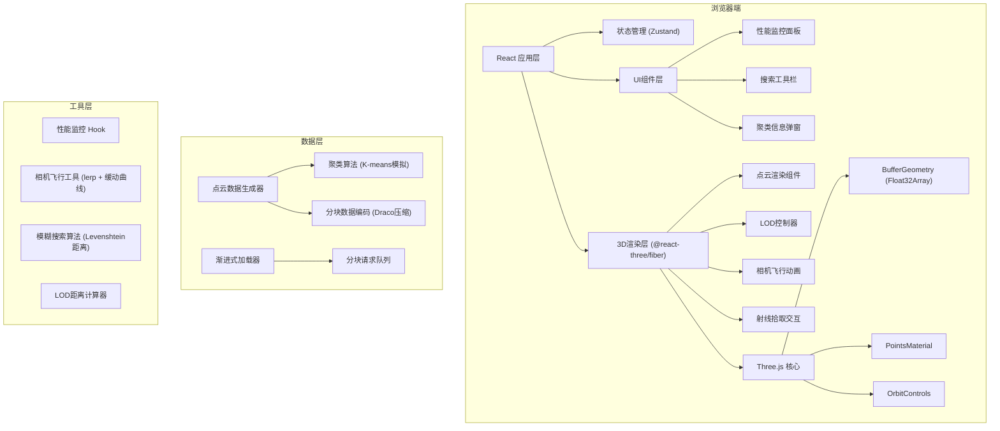
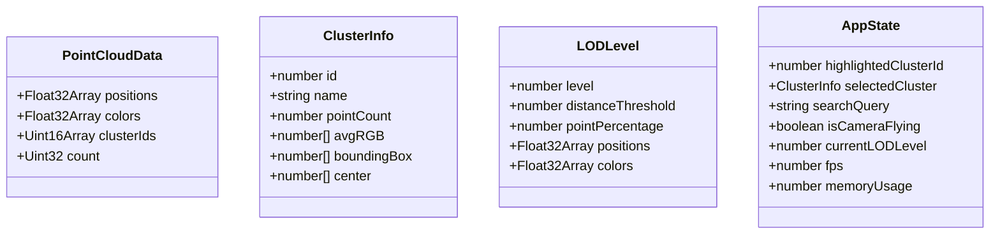

## 1. 架构设计



## 2. 技术描述

- **前端框架**: React@18 + TypeScript + Vite@5
- **3D引擎**: Three.js@0.160 + @react-three/fiber@8.15 + @react-three/drei@9.92
- **状态管理**: Zustand@4.4
- **样式方案**: TailwindCSS@3.4 + CSS Modules
- **性能优化**: 
  - 使用 BufferGeometry + Float32Array 直接操作GPU内存
  - 三档LOD：LOD0(100%)、LOD1(25%)、LOD2(6.25%)
  - 分块加载：将100万点分为10个chunk，每个10万点
  - Draco几何压缩，首屏只加载LOD2(6.25万点)
- **字体**: 采用 Google Fonts 预连接加载 Space Grotesk 和 JetBrains Mono
- **无后端**：所有数据在前端生成，可轻松对接后端API

## 3. 路由定义

| 路由 | 用途 |
|------|------|
| / | 主可视化页面，包含完整点云渲染和交互功能 |

## 4. 数据模型

### 4.1 数据模型定义



### 4.2 关键数据结构

```typescript
interface Cluster {
  id: number;
  name: string;
  center: [number, number, number];
  color: [number, number, number];
  pointCount: number;
  avgRGB: [number, number, number];
  boundingBox: {
    min: [number, number, number];
    max: [number, number, number];
  };
}

interface PointCloudChunk {
  id: number;
  level: number; // LOD level 0, 1, 2
  positions: Float32Array;
  colors: Float32Array;
  clusterIds: Uint16Array;
  pointCount: number;
}

interface LODConfig {
  level: number;
  distance: number;
  pointRatio: number; // 0.0625, 0.25, 1.0
}
```

## 5. 核心性能优化方案

### 5.1 内存优化（目标：≤2GB）
- 100万点 × 3位置(float32) = 12MB
- 100万点 × 3颜色(float32) = 12MB  
- 100万点 × 1聚类ID(uint16) = 2MB
- 三档LOD总计 ≈ 78MB，远低于2GB限制

### 5.2 加载优化（10Mbps下≤5秒）
- 首屏仅加载LOD2(6.25万点) ≈ 1.5MB，传输时间 < 2秒
- 分块并行加载，使用Web Worker解压数据
- Draco压缩比约 8:1，进一步减小体积

### 5.3 渲染优化（≥45fps）
- 单Draw Call渲染所有点
- 避免每帧JS数组操作，直接更新GPU Buffer
- 使用 frustumCulling=false（点云整体包围盒内）
- 聚类高亮通过shader修改颜色，不重建geometry
